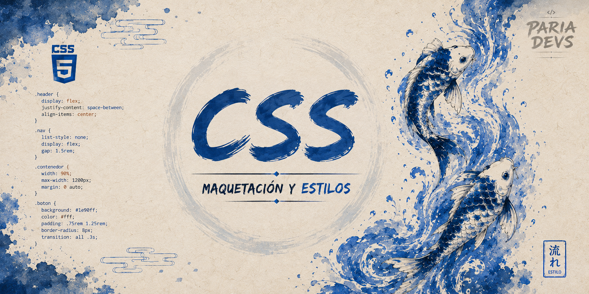

# CSS: de la estructura al estilo

  

Bienvenidos a la sección de CSS, la parte donde nuestras páginas dejan de verse como maquetas aburridas y empiezan a tener identidad, personalidad y estilo propio.

Si HTML nos da la estructura, CSS es el toque final que hace que todo se vea bien: colores, spacing, tipografías, layouts, responsividad y ese detalle que hace que una web se sienta premium.

Aquí vamos a aprender a darle forma a lo que construimos, desde lo más básico hasta cosas más chidas como Flexbox, Grid, diseño responsive y animaciones. No es solo poner estilos, sino hacer que la experiencia del usuario sea más clara, bonita y usable.

> Si quieres ver el camino completo del curso, te dejo el roadmap principal: [📍 Ir al roadmap](../../docs/roadmap.md)

## 𓇼 Lo que vamos a ver

| Tema | Qué aprenderemos |
|------|------------------|
| Fundamentos | Selectores, cascada, especificidad y modelo de caja |
| Layout | Posicionamiento, display, flujo y manejo del espacio |
| Diseño visual | Tipografía, colores, fondos, contrastes y composición |
| Responsive | Mobile-first, media queries y adaptación a pantallas |
| Flexbox y Grid | Estructuras modernas para crear interfaces limpias |
| CSS moderno | Variables, funciones, unidades y mejores prácticas |
| Interactividad | Transiciones, animaciones y microinteracciones |
| Accesibilidad | Diseño inclusivo, legibilidad y experiencia mejor para todos |

## 𓇼 ¿Por qué CSS importa?

Porque es la diferencia entre una página que “funciona” y una página que se ve bien, se siente bien y ofrece una mejor experiencia.

Aquí vamos a aprender a:

- organizar el contenido visualmente,
- crear layouts bonitos y funcionales,
- hacer que las páginas se adapten al móvil,
- mejorar la legibilidad,
- y darle ese toque profesional que se nota a simple vista.

## 𓇼 ¿Qué te espera en esta sección?

Vamos a ir paso a paso, sin complicarnos demasiado, pero con la intención de que cada tema te ayude a construir cosas reales y útiles.

La idea es que al final de esta sección ya no mires CSS como “un montón de reglas”, sino como una herramienta poderosa para crear interfaces con estilo, orden y personalidad.

## 𓇼 En resumen

CSS no es un extra: es parte clave de la web. Es lo que convierte un documento plano en algo visual, moderno y preparado para la comunidad.

Y aquí, en esta sección, vamos a ponerle sabor a nuestras páginas. 
